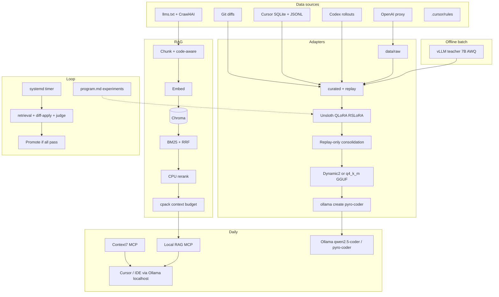

# Hybrid Local Coding Assistant — PLAN

**Project:** LLM Self Training  
**Hardware:** RTX 4070 Ti (12 GB VRAM) · i9-14900K · 32 GB RAM  
**Runtime policy:** **Bare metal only — no Docker** (eval sandboxes: git worktrees, subprocess, optional `bubblewrap`/`firejail`)  
**Inference:** Ollama 0.23.2  
**Primary IDE:** Cursor (Continue.dev optional, not default)  
**Document version:** 2026-05-30 (monorepo + dashboard + benchmarks)  
**Status:** Implementation-ready spec  
**Research basis:** Exa/Context7 + **165 research agents** (scrutiny + pass 2, bare-metal validated)  
**Execution:** [`ROADMAP.md`](ROADMAP.md) · **Linear:** filter `[LLM-ST]` on team COM

---

## Executive summary

Build a **three-layer** local system for a **personal coding copilot** (style + debugging + “knows you” tone) for everyday smaller tasks — private, offline, improvable weekly. Not Opus-scale; your intimate daily companion.

Three layers:

| Layer | Job | Update cadence |
|-------|-----|----------------|
| **RAG** | Private/project doc truth (Context7 handles public libs) | Weekly crawl + re-index |
| **QLoRA (Unsloth)** | Your naming, structure, patch habits | Weekly, **eval-gated** |
| **Orchestration** | Ingest → curate → train → promote | `systemd` + `program.md` loop |
| **Control plane** | See data, runs, benchmarks, quarantine bad rows | **`apps/dashboard`** + **`apps/api`** + `warehouse/` |

**Inference default:** `qwen2.5-coder:7b` (Q4) — **train and promote on this base** (Qwen3-Coder-Next does not fit 12 GB QLoRA).  
**Inference bake-off (optional):** `deepseek-coder-v2-lite` (~5 GB Q4 MoE).  
**Embed default:** `nomic-embed-text` for Phase 1; **eval-gate** upgrade to `jina-code-embeddings-0.5b` or `qwen3-embedding:0.6b` if retrieval gold &lt; 80%.  
**Train base:** `unsloth/Qwen2.5-Coder-7B-Instruct-bnb-4bit`.  
**Exclude from daily loop:** `phi4-reasoning:14b` (no VRAM for RAG + coder). Use **`deepseek-r1:7b`** only as **swap-only** debug eval judge (stop coder first).

**Stack choices (scrutiny-validated):**

- **Train:** Unsloth + TRL SFTTrainer primary; **LLaMA-Factory** (+Unsloth backend) when DPO/ORPO/GUI needed; Axolotl for multi-GPU CI only
- **PEFT:** QLoRA + **RSLoRA**; optional **LoftQ** init Phase 4 A/B; **LoRA+** Phase 6+; defer DoRA/GORP/CURLoRA/O-LoRA/OSF until replay baseline passes
- **Continual:** Start **60% new / 40% replay** → drift **75–85% new** when buffer mature; **mandatory** post-train replay-only consolidation (~15–25% steps); **merge to dense** before Ollama (versioned PEFT = archive only)
- **Public SFT (20–30%):** `OpenCodeInstruct` via **EER6/broad** (LLM judge ≥4 + `average_test_score ≥ 0.8`) + **`TIGER-Lab/SWE-Next-SFT-Trajectories`** (~**3.7k**; map `tool`→`user`, truncate seq 2048) + **SelfCodeAlign** (~3k); optional ≤500 **SWE-smith patch-only**; drop bulk OpenCoder stage2 (Evol overlap); **reject KodCode**
- **Logger:** **FastAPI** `services/logger` (JSONL schema, Phase 3); **Ollama** serves `http://127.0.0.1:11434/v1` natively; tunnel/Linx **only if** a client cannot call localhost; **LiteLLM CustomLogger** when multi-provider or SSE hardening needed
- **Data:** SQLite (`AI-Data-Extraction`) + **`cursor_transcripts.py`** (agent JSONL) + **custom Codex event reducer** + git + proxy; labels: human + **exec/verify/test_signal**
- **Synthetic teacher:** **vLLM** batch (`localhost:8000/v1`); **Ollama** for daily inference only
- **Google Tunix/Gemma:** Loop ideas only; not Qwen2.5-Coder ship path

---

## Research synthesis

Condensed from 90 agent reports. Rows marked **(scrutiny)** added May 2026.

### Training stack

| Topic | Decision |
|-------|----------|
| **Framework** | **Unsloth primary** on 12 GB. LLaMA-Factory for DPO/ORPO/GUI; Axolotl multi-GPU/YAML CI, not first 12 GB run |
| **Speed** | ~2× vs vanilla TRL; ~8–10 GB VRAM @ seq 2048. Pin `pip install -U unsloth unsloth_zoo` (May 2026 NVIDIA collab: ~15–25% extra when packing+Unsloth GC enabled) |
| **Fused CE** | **On by default** in current Unsloth; modest VRAM headroom @ 2048. Skip Liger+Unsloth |
| **torch.compile** | Optional; marginal — profile, don't default |
| **TRL / SFTConfig** | Pin **`trl>=1.0,<2`** at scaffold (Qwen2.5 `assistant_only_loss` auto-patch needs v1.0+; `>=0.29` floor in comments only); **`eval_packing=False`**; `learning_rate=2e-4`, cosine, `warmup_ratio=0.05`, `max_grad_norm=0.3` |
| **Packing** | **Default: rely on Unsloth auto padding-free** (`packing=False`). Enable `packing=True` only after A/B shows ≥25% speedup **and** holdouts pass |
| **`for_training()`** | **Not required** for vanilla SFT after `get_peft_model`; use only after `for_inference()` mid-run; if used: `use_gradient_checkpointing="unsloth"` |
| **LoRA** | Bootstrap **r=16, α=32**; promote default **r=32, α=32**; optional **LoftQ** stacked with RSLoRA |
| **Optimizer** | `adamw_8bit` + cosine + warmup; Prodigy/Schedule-Free = Phase 6+ experiments |
| **NEFTune** | Optional `neftune_noise_alpha=5`; A/B vs no-NEFTune on style+debug gates |
| **Export quant** | Train: bnb NF4 unchanged. **Ship:** Unsloth **Dynamic 2.0** GGUF via `save_pretrained_gguf` + `q4_k_m` (works today for Qwen2.5-Coder); A/B Q4 vs Q5 after eval; **not** Ollama `ADAPTER` |
| **Time budget** | Extrapolated; smoke-train on 4070 Ti before trusting cadence |

#### Fused cross-entropy (Unsloth)

Chunked LM-head loss; **on by default** in current Unsloth (no manual `for_training()` for vanilla SFT). **Tiled MLP** only if experimental seq ≫ 4096. May 2026 NVIDIA collab (~8–14% dense 7B) is separate (padding-free metadata + GC) — pin fresh `unsloth` weekly.

### Continual learning

| Topic | Decision |
|-------|----------|
| **Replay** | 60–40 new/replay start → **75–85% new** when stable; buffer 3–5k; **loss-prioritize** within strata; promote only if **old + new** pass |
| **Consolidation** | **Mandatory** replay-only pass post-train (15–25% of weekly steps) per arXiv:2505.12512 pattern |
| **Merge** | **Promote merged dense weights** to Ollama; optional **mergekit `dare_ties`** if 2–3 weekly adapters good but replay fails |
| **GORP / CURLoRA / O-LoRA / OSF** | **Defer v1** — no Unsloth path. Phase 6+: **FlyLoRA** first, then PEFT OSF if forgetting persists |
| **Multi-task QLoRA** | **Task-tagged mixed SFT** in one Unsloth run; optional short **debug-only** pass if debug gate fails |
| **Preference FT** | **Defer** DPO/ORPO/KTO until replay+QLoRA fails style gate twice; proxy labels reserved |

### Data & datasets

| Topic | Decision |
|-------|----------|
| **HF public mix** | **OCI** (EER6/broad subsample) + **SWE-Next trajectories** + **SelfCodeAlign**; optional ≤500 **SWE-smith** patch-only rows |
| **Personal ratio** | Bootstrap 60–70% personal; **≥1k accepted** before first promote; mature weekly **75–85% personal** (up to **90%** only if ≥1k tier-1 rows and eval stable) |
| **Style metadata** | Curated rows: `style_tags`, `project`, `tone` (+ replay stratification) — see **Data schemas** appendix |
| **Min pairs** | **200–500** = pipeline smoke only; **≥500** for eval-gated promote; **1k–5k** = real adapter target |
| **Synthetic** | OSS-Instruct via **vLLM** teacher (not Ollama); filter + exec where possible |
| **Git** | PyDriller; single-file/small-diff filter; optional **delta summaries** (Inc-FT pattern); no bulk CommitPackFT |
| **Cursor** | `AI-Data-Extraction` (SQLite) + **`cursor_transcripts.py`** (JSONL — tool outputs often missing in JSONL alone) |
| **Codex** | Custom **`codex_sessions.py`** reducer → `messages[]`; codex2parquet for EDA only |
| **Claude Code** | Optional `~/.claude/projects/*.jsonl` via **cc2cx** or small parser if present |
| **Data hygiene** | **gitleaks + regex + Presidio/GLiNER PII** only (not content-policy / refusal filtering); TruffleHog no-verify at promote audit |
| **Labels** | `accepted` / `edited_heavily` / `rejected` **plus** `exec`, `verify`, `test_signal`; tier-1 SFT = accepted **and** (exec pass **or** cursor verify ok) |

### RAG & inference

| Topic | Decision |
|-------|----------|
| **Crawl** | **llms.txt / llms-full.txt tier-0** before Crawl4AI; allowlist **non-Context7** sites only |
| **Chunking** | Phase 1: SentenceSplitter 512/50; Phase 1.5+: **Chonkie `CodeChunker`** (stable) for repo/docs code; optional `chonkie.experimental` AST if gold set re-validated |
| **Vector DB** | **Chroma ≥1.5**; single-writer lock in `loop.py` |
| **Embed** | Start `nomic-embed-text`; Phase 1.5 if gold &lt;80%: **jina-code-embeddings-0.5b** |
| **Hybrid** | BM25 + RRF k=60; rerank **ms-marco-MiniLM** CPU → swap **bge-reranker-v2-m3** if ordering weak |
| **HyDE / GraphRAG** | **No** v1; deterministic query expansion first if needed |
| **Context7** | Public libs live; local RAG = private repos + allowlisted docs |
| **Code structure** | **Code-graph / GitNexus MCP** at IDE time — not Chroma ingest |
| **RAG inject** | **Thin local RAG MCP** week 1 (not 2 weeks paste-only) |
| **Cursor / clients** | Default: **Ollama native API** on `127.0.0.1:11434/v1`. HTTPS tunnel **optional fallback** only if BYOK from Cursor cloud cannot reach localhost |

### Google / alternate

- Gemma + Tunix + JAX: second stack; not Qwen2.5-Coder → GGUF → Ollama path
- LearnLM / Gemini: cloud only

---

## Architecture



### Responsibility split

| Need | Mechanism | Do not |
|------|-----------|--------|
| API/version truth (public libs) | Context7 MCP | Duplicate in crawl allowlist |
| API/version (your stack) | Local RAG | — |
| Style, structure, tone | QLoRA + slim system prompt | LoRA RTK/caveman rules |
| Patch / debug habits | Curated diffs + exec-verified rows | Raw agent dumps |
| Code structure at edit time | Code-graph MCP | Microsoft GraphRAG weekly index |
| Continual learning | Replay + consolidation + eval gate | Blind retrain on latest only |

---

## Model selection & VRAM (12 GB)

| Model | Role |
|-------|------|
| `qwen2.5-coder:7b` | **Ship** — inference + QLoRA base |
| `deepseek-coder-v2-lite` | Inference bake-off only (~5 GB Q4) |
| `deepseek-r1:7b` | **Swap-only** debug eval (sequential; stop coder) |
| `phi4-reasoning:14b`, `qwen3.5:9b` | Park — no concurrent hybrid load |
| `qwen3-coder-next` | **Defer** — 30GB+ Q4; no 12 GB QLoRA path |

**Operating rules:**

1. One GPU-heavy job: train **or** chat **or** embed batch **or** vLLM synth — `ollama stop` between phases.
2. RAG: 4–8 chunks × ~800 tok; `num_ctx` 8192–16384.
3. Training / vLLM synth: Ollama stopped.
4. No 14B + embed + 7B KV on 12 GB.

### Disk budget (bare metal)

| Path | Y1 steady-state | Policy |
|------|-----------------|--------|
| `data/raw/` | 3–10 GB (~3–8 GB/yr growth) | Append-only; gzip archive >90d |
| `data/curated/` + `data/replay/` | &lt;0.2 GB | Bounded by row targets |
| `data/chroma_db/` | 0.5–1.5 GB (2× during embed migration) | Versioned embed dirs |
| `adapters/` + `exports/` + `runs/` | **15–25 GB** | Keep last N adapters; archive old GGUF |
| `data/warehouse/` | &lt;0.5 GB | **Turso** (`control_plane.db`) — see `docs/oss/TURSO.md` |
| Ollama models + HF cache | 30–60 GB (system) | Outside repo |

**Minimum:** 100 GB free on data volume · **Comfortable:** 250 GB

```bash
ollama pull qwen2.5-coder:7b
ollama pull deepseek-r1:7b          # debug eval swap
# optional bake-off: ollama pull deepseek-coder-v2-lite
```

**DeepSeek 16B bake-off triggers (open decision #3 resolved):**

| Gate | Threshold |
|------|-----------|
| GO | Style parity, debug +5pp vs base, latency ≤2×, no OOM @ 8k ctx, embed/RAG off during run |
| WIN | Promote to daily driver; still train Qwen2.5 unless you re-base eval |

---

## Recommended stack

| Layer | Tool |
|-------|------|
| Inference (daily) | Ollama |
| Inference (synth batch) | **vLLM** (7B AWQ, OpenAI-compatible) |
| RAG core | **httpx** + Chroma + Crawl4AI (LlamaIndex optional for fusion experiments) |
| Retrieval v1.5 | `rank_bm25` + RRF + CPU cross-encoder (upgrade path: Qwen3 reranker) |
| Fine-tune | **Unsloth** + TRL |
| Logger | **FastAPI** or **Linx** → raw JSONL; LiteLLM CustomLogger later |
| IDE | Client → **Ollama `127.0.0.1:11434/v1`**; **Context7** for public docs |
| Code context | **Code-graph / GitNexus** MCP (already in your stack) |
| Automation | **systemd timer** + `orchestrator/loop.py` + `program.md` |
| Crawl | **llms.txt first**, then Crawl4AI; cloud Firecrawl only if one URL blocks local crawl |
| Proxy (Phase 3+) | Optional FastAPI logger → Ollama; tunnel/Linx only if localhost unreachable |

---

## Repository layout (uv monorepo)

**Monorepo:** shared types, one API for the dashboard, benchmark history in **Turso** warehouse (`docs/oss/TURSO.md` — implement Phase 1.5 step-by-step from official docs). `apps/dashboard` is Bun/Vite sibling (not a uv member).

```text
LLM Self Training/
├── PLAN.md
├── ROADMAP.md
├── README.md
├── pyproject.toml                 # uv workspace root
├── uv.lock
├── .gitignore
├── config/
│   ├── default.yaml
│   └── models.yaml
│
├── apps/                          # deployable surfaces
│   ├── api/                       # FastAPI — read/write control plane
│   │   ├── main.py
│   │   └── routes/                # data, runs, benchmarks, quarantine
│   └── dashboard/                 # Vite + React + shadcn — operator UI
│       ├── src/pages/
│       │   ├── Overview.tsx       # KPIs, latest promote, GPU hint
│       │   ├── DataLake.tsx       # tier counts, tags, reject queue
│       │   ├── Training.tsx       # run timeline, adapters, exports
│       │   └── Benchmarks.tsx     # suites, trends, run trigger
│       └── package.json
│
├── packages/                      # importable Python libs (workspace members)
│   ├── core/                      # config, paths, pydantic models
│   ├── dataprep/                  # cursor, codex, git, filters
│   ├── rag/                       # crawl, ingest, query, mcp_server
│   ├── train/                     # train_qlora, export_gguf
│   ├── eval/                      # run_eval, VERDICT, internal JSONL suites
│   ├── benchmarks/                # SWE-bench micro, LCB lite, Aider micro runners
│   └── orchestrator/              # loop.py, program.md, activity detector
│
├── services/
│   └── logger/                    # FastAPI or Linx forwarder + schema
│
├── data/                          # gitignored volumes (bind-mount in prod)
│   ├── raw/
│   ├── curated/
│   ├── replay/
│   ├── chroma_db/
│   ├── adapters/
│   ├── exports/
│   └── warehouse/                 # Turso SSOT for dashboard + trends (docs/oss/TURSO.md)
│       └── control_plane.db
│
├── eval/                          # task definitions (committed)
│   ├── internal/                  # style, debug, diff_apply, retrieval_gold
│   └── external/                  # swe_micro/, lcb_lite/ manifest + pin commits
│
├── experiments/
│   └── train_adv_peft.py
├── deploy/
│   └── llm-self-train.service     # systemd; api + dashboard via host Bun/uv (no containers)
└── runs/                          # ephemeral job dirs (gitignored)
```

**Workspace members** (root `pyproject.toml`):

```toml
[tool.uv.workspace]
members = [
  "packages/*",
  "apps/api",
  "services/logger",
]
```

`apps/dashboard` stays **Node/Bun** sibling (not a uv member); talks to `apps/api` only.

---

## Dependencies

```toml
[project]
name = "llm-self-training"
version = "0.4.0"
requires-python = ">=3.11"
dependencies = [
    "chromadb>=1.5",
    "crawl4ai>=0.4",
    "rank-bm25>=0.2.2",
    "sentence-transformers>=3.0",
    "pydantic>=2",
    "pyyaml",
    "httpx",
    "tqdm",
    "uvicorn",
    "fastapi",
    "gitpython",
]

[project.optional-dependencies]
train = [
    "torch",
    "transformers>=4.40",
    "datasets",
    "peft>=0.16",
    "trl>=1.0,<2",
    "bitsandbytes",
    "accelerate>=0.34",
    "unsloth @ git+https://github.com/unslothai/unsloth.git",
]
dataprep = ["pydriller", "gitleaks", "presidio-analyzer", "presidio-anonymizer"]
rag-chunk = ["chonkie[code]>=1.6"]
merge = ["mergekit>=0.0.5"]
eval = ["ragas>=0.2"]
orchestrate = ["langgraph>=0.2"]  # Phase 5+ optional experiments only
train-experimental = ["liger-kernel>=0.5"]  # incompatible with Unsloth — do not combine
```

```bash
uv sync
uv sync --extra train --extra dataprep --extra eval
# optional: --extra rag-chunk --extra merge
```

---

## Interaction logger

**Custom FastAPI proxy** forwards to Ollama; logs full request/response bodies to `data/raw/logs-YYYY-MM-DD.jsonl`.

**Ollama (default):** OpenAI-compatible API on **`http://127.0.0.1:11434/v1`** — use this for local scripts, eval, Phase 3 logger → Ollama, and any IDE/client that can call localhost.

**Tunnel (optional):** Some Cursor BYOK setups route via Cursor’s cloud and **cannot** reach `localhost`; only then use **Cloudflare Tunnel / ngrok** or **Linx** for a public HTTPS `/v1`. If your Cursor setup talks to `127.0.0.1:11434` directly, skip tunnel entirely.

**Linx vs FastAPI:** Linx = optional shim + aliases; FastAPI logger = your JSONL schema (Phase 3).

**LiteLLM:** Phase 3+ when SSE/tool-call reassembly or multi-provider needed — CustomLogger maps to your raw schema.

---

## Data preparation

### Sources (priority)

Unified CLI: `uv run --package llm-dataprep agent-ingest` (registry: `packages/dataprep/.../harnesses.py`; probe: `--list-harnesses`).

| Harness | Storage (May 2026) | Ingest module |
|---------|-------------------|---------------|
| Git | your repos | `git_diffs.py` |
| Cursor | `~/.cursor/projects/*/agent-transcripts/**/*.jsonl` | `cursor_transcripts.py` |
| Codex | `~/.codex/sessions/**/rollout-*.jsonl` | `codex_sessions.py` |
| Pi | `~/.pi/agent/sessions/--<cwd>--/*.jsonl` | `pi_sessions.py` |
| OpenCode | `~/.local/share/opencode/opencode.db` | `opencode_db.py` |
| T3 Code | `~/.t3/userdata/state.sqlite` | `t3_threads.py` |
| Aider | `.aider.chat.history.md` (per repo) | `aider_history.py` |
| Cline | VS Code `globalStorage/saoudrizwan.claude-dev/tasks` or `~/.cline/data` | `cline_tasks.py` |
| Continue | `~/.continue/sessions/*.json` | `continue_sessions.py` |
| Gemini CLI | `~/.gemini/tmp/<hash>/chats/session-*.jsonl` | `gemini_cli.py` |
| Claude Code | `~/.claude/projects/<hash>/*.jsonl` | `claude_sessions.py` |
| Windsurf | `~/.codeium/windsurf/cascade` (AES) | **skip** — UI export only |

Also planned: proxy logs, synthetic OSS-Instruct, public HF. Dual SQLite (`AI-Data-Extraction`) deferred.

### Curation pipeline

| Step | Action |
|------|--------|
| Merge | Union sources; dedupe by session/time |
| Normalize | OpenAI `messages[]`; **`assistant_only_loss=True`** in SFTConfig |
| Strip | Tool schema dumps, failed loops, subagent noise, secrets |
| Link | `link_logs_to_diffs.py` → labels + **exec/verify/test_signal** |
| Safety | gitleaks + Presidio/GLiNER; promote audit: secrets **and** PII |
| Quality | Tier-1 train = accepted + exec/verify pass; `edited_heavily` → human final as target |
| Metadata | `style_tags[]`, `project`, `tone` on curated rows for replay strata + style lint |

### ShareGPT row (git patch style)

```json
{
  "conversations": [
    {"from": "system", "value": "Apply changes in the user's style."},
    {"from": "human", "value": "Task: ...\n\n```diff\n...\n```"},
    {"from": "gpt", "value": "```go\n...\n```"}
  ],
  "meta": {
    "label": "accepted",
    "exec": "pass",
    "train_tier": 1,
    "project": "llm-self-training",
    "style_tags": ["go", "tests", "minimal-diff"],
    "tone": "direct"
  }
}
```

---

## Training defaults (4070 Ti, 7B QLoRA)

```python
# import unsloth first — pin unsloth + unsloth_zoo before each run
model, tokenizer = FastLanguageModel.from_pretrained(
    model_name="unsloth/Qwen2.5-Coder-7B-Instruct-bnb-4bit",
    max_seq_length=2048,
    load_in_4bit=True,
    dtype=None,
)
model = FastLanguageModel.get_peft_model(
    model,
    r=16,  # bootstrap; promote at r=32 after baseline passes
    lora_alpha=32,
    target_modules="all-linear",
    lora_dropout=0,
    use_rslora=True,
    use_gradient_checkpointing="unsloth",
    # loftq_config={...}  # optional Phase 4 A/B
)
# FastLanguageModel.for_training(model)  # optional; not required vanilla SFT

# SFTConfig (trl>=1.0):
#   assistant_only_loss=True
#   packing=False  # Unsloth auto padding-free; A/B packing later
#   per_device_train_batch_size=2, gradient_accumulation_steps=8
#   bf16=True, optim="adamw_8bit", learning_rate=2e-4
#   lr_scheduler_type="cosine", warmup_ratio=0.05, max_grad_norm=0.3
#   max_steps = (len(packed_dataset) // effective_batch) * num_epochs  # cap 100-150 continual
#   neftune_noise_alpha=5  # optional A/B
#   eval_packing=False
```

**Continual:** 60–40 new/replay → mature 75–85% new; **mandatory** replay-only consolidation slice; save `adapters/pyro-coder-YYYY-MM-DD`; promote only if eval passes.

**Export:**

```python
# Dynamic 2.0 GGUF (Unsloth; Qwen2.5-Coder supported today):
model.save_pretrained_gguf("exports/pyro-coder", tokenizer, quantization_method="q4_k_m")
# Merge adapter into base before GGUF — versioned adapters archived under adapters/
# ollama create pyro-coder:7b -f exports/pyro-coder/Modelfile
```

Do **not** rely on Ollama native `ADAPTER` for Qwen2.5 QLoRA — use merged GGUF path.

---

## Eval & benchmarks (promotion + dashboard)

Two tiers: **fast internal** (every train) and **external anchors** (scheduled / on-demand from dashboard). All results land in **`data/warehouse/control_plane.db`** for trends.

### Internal suites (promotion gate — every candidate adapter)

| Suite | Purpose | Gate |
|-------|---------|------|
| `retrieval_gold.jsonl` | Doc/repo Q&A | hit-rate@5 ≥ 80% → hybrid+rerank |
| `tasks_diff_apply.jsonl` | **Primary** — `git apply` + tests on frozen snapshots | Must not drop >5% vs base |
| `tasks_style.jsonl` | Style | **VERDICT** protocol below |
| `tasks_debug.jsonl` | Bugs | Pass rate vs base; optional **deepseek-r1:7b** swap |

**15–25 tasks** minimum per internal suite from real work.

### External benchmarks (Benchmarks page — trend + research)

| Benchmark | Package runner | Cadence | VRAM note |
|-----------|----------------|---------|-----------|
| **SWE-style micro (bare metal)** | `packages/benchmarks/swe_micro` | Monthly + before major promote | Frozen repo worktrees + `git apply` + host `pytest`/`make test` — **no Docker** |
| **LiveCodeBench lite** | `packages/benchmarks/lcb_lite` | Monthly | CPU/GPU codegen pass@k |
| **Aider polyglot micro** | `packages/benchmarks/aider_micro` | Monthly | Edit/apply subset |
| **HumanEval+ / MBPP** (optional) | `packages/benchmarks/classic` | Quarterly | Quick regression sanity |

Dashboard shows **per-model time series** (baseline `qwen2.5-coder:7b` vs each `pyro-coder-*`), delta vs previous run, and **fail-case drill-down** (prompt, diff, logs).

### Benchmark → training feedback loop

```text
benchmark run → warehouse rows (pass/fail, task_id, model_id)
       ↓
failures with traceable curated_id → quarantine (train_tier=0) or downweight in replay
       ↓
success patterns (style_tags, project) → optional upsample in next replay stratum
       ↓
loop.py: block promote if any internal gate OR external anchor regresses > floor
```

**Quarantine rules (v1):**

- Auto-quarantine curated rows linked to **regressed** diff_apply / debug tasks (same `session_id` or `row_id` in metadata).
- Manual quarantine in dashboard (operator override).
- Quarantined rows never enter SFT; may enter **preference negative** pool later (Phase 6+).

**Do not** delete raw logs on benchmark fail — demote in curated layer only.

### VERDICT style lane (`run_eval.py`)

1. Generate candidate + baseline at T=0.
2. **`style_lint`** (CPU regex: naming, layout).
3. **Pairwise judge:** `RISE-Judge-Qwen2.5-7B` via Ollama (swap A/B); **`ggozad/prometheus2`** fallback after 20-sample human calibration if κ higher; one judge per run on 12 GB.
4. Promote iff `win_rate ≥ previous + 5%` and lint pass rate not down >5%.

`loop.py` requires `"verdict": "pass"` on **all internal** suites; external anchors use **regression floor** (no new regression vs last promoted model).

### Autoresearch pattern (`program.md`)

Adopt Karpathy-style loop: **immutable** `run_eval.py`; agent edits only train hyperparams / replay ratio; **`eval_score`** composite for keep/discard only (v1 weights ~**0.45** diff_apply + **0.25** style + **0.15** debug + **0.15** retrieval); promote still requires per-suite `"verdict": "pass"`. `results.tsv` + keep/discard commits. Non-goal on pretrain bpb, not on the loop pattern.

---

## IDE integration

| Mode | When |
|------|------|
| **Context7 MCP** | Public third-party docs (always) |
| **Local RAG MCP** | Your allowlisted + private docs (week 1) |
| **Code-graph MCP** | Structure / impact at edit time |
| **Ollama `/v1`** | Local inference (default). Tunnel only if client cannot use localhost |
| **Logger proxy** | Unified JSONL + forward |
| **RAG paste** | Fallback only |
| **Continue.dev** | Optional true-local path (not day-one) |

---

## Constraints (bare metal)

- **No Docker / Podman / docker-compose** for eval, train, api, or dashboard
- Eval isolation: **`git worktree`** + **subprocess** (`pytest`, `make test`); optional **`bubblewrap`** for untrusted generated code
- Official SWE-bench harness is Docker-only — use **`tasks_diff_apply.jsonl`** + **`swe_micro` manifest** instead
- One GPU-heavy job at a time; **`ollama stop`** before train, embed batch, or vLLM synth

---

## Data schemas (appendix)

### Curated row (`data/curated/*.jsonl`)

Prefer OpenAI `messages[]`; ShareGPT `conversations[]` OK for patch-heavy rows.

| Field | Required | Notes |
|-------|----------|-------|
| `meta.label` | yes | `accepted` \| `edited_heavily` \| `rejected` |
| `meta.exec` | recommended | `pass` \| `fail` \| `unknown` |
| `meta.train_tier` | yes | `1` train · `2` replay-only · `0` drop/quarantine |
| `meta.project`, `style_tags`, `tone` | recommended | Replay strata + `style_lint` |
| `meta.session_id`, `meta.ts` | recommended | Traceability for quarantine |

**Tier-1 gate:** `accepted` (or human-final `edited_heavily`) **and** (`exec==pass` or `verify==cursor_ok`) **and** gitleaks/PII pass.

### Raw proxy log (`data/raw/logs-YYYY-MM-DD.jsonl`)

One JSON object per line: `ts`, `model`, `messages` (request), `response`, optional `usage`, `client`, `session_id`. Never commit real secrets — samples redacted only.

---

## Pass 2 research (condensed verdicts)

No stack pivot. **Ship:** worktree eval, Dynamic 2.0 GGUF merge path, dual systemd timers, **Turso** warehouse, Recharts dashboard, Presidio+GLiNER, FastMCP RAG. **Defer:** prefs, GORP/CURLoRA/OSF/FlyLoRA, TorchAO QAT, Nix, full Aider 225. **Reject:** Docker eval, Ollama `ADAPTER`, txtai core, KodCode, detect-secrets v1.

---

## Explicit non-goals (initial release)

- **Docker / Podman / containerized eval** (including official SWE-bench Docker harness)
- **docker-compose** for api/dashboard/train
- Continue.dev as day-one requirement
- Self-hosted Firecrawl as anti-bot layer (cloud escrow per URL only)
- LangGraph in **core** deps (Phase 5+ experiments OK)
- Raw chat/agent dumps without curation
- **Content-policy / refusal filters** on training data (no dropping rows for “hacking,” exploits, or edgy topics — only secrets/PII hygiene)
- GORP / CURLoRA / O-LoRA / OSF before replay+QLoRA baseline works
- `val_bpb` as promotion metric (autoresearch **loop pattern** is in scope)
- `phi4-reasoning:14b` as daily driver
- Preference optimization (DPO/ORPO/KTO) before two failed style gates on replay baseline
- Microsoft GraphRAG weekly index on crawl corpus

---

## Open decisions (user)

1. **Languages + doc allowlist** — still user
2. **Repos + Cursor projects boundary** — still user
3. **DeepSeek bake-off** — use table in Model selection when ready
4. **Fast vs default phase ordering** — see [`ROADMAP.md`](ROADMAP.md)

---

## Operator dashboard (product UI)

**Goal:** One local URL to see **everything that drives training** — not a generic MLflow clone; an operator console for *your* copilot.

| Page | Shows | Actions |
|------|--------|---------|
| **Overview** | Models (base vs `pyro-coder-*`), last promote, GPU/Ollama status, tier-1 count | — |
| **Data lake** | Rows by `train_tier`, `project`, `style_tags`, reject/quarantine queue | Quarantine / restore row |
| **Training** | Run history, loss snapshots, adapter path, export status | — |
| **Benchmarks** | Internal + external suite scores over time; pass/fail drill-down | **Run suite** (queues job; `ollama stop` first) |
| **RAG** (Phase 4+) | Index size, gold hit-rate, last crawl | Re-index allowlist |

Stack: **`apps/api`** (FastAPI) reads/writes Turso `warehouse` + scans `data/`; **`apps/dashboard`** (Vite + React + shadcn + **Recharts** + TanStack Table/Query). Run: `uv run api` + `bun dev` on host (no compose). Jobs: Turso rows + single consumer subprocess (no Redis). Warehouse implementation: follow `docs/oss/TURSO.md` in order.

---

## Reference index (tools & papers)

| Area | Links |
|------|-------|
| Unsloth | [fine-tuning guide](https://unsloth.ai/docs/get-started/fine-tuning-llms-guide), [Qwen Coder](https://unsloth.ai/blog/qwen-coder), [bnb-4bit](https://huggingface.co/unsloth/Qwen2.5-Coder-7B-Instruct-bnb-4bit), [NVIDIA collab May 2026](https://unsloth.ai/blog/nvidia-collab), [inference/export](https://unsloth.ai/docs/get-started/inference-and-deployment) |
| Qwen | [Qwen3-Coder](https://github.com/QwenLM/Qwen3-Coder), [Qwen3 embed](https://github.com/QwenLM/Qwen3-Embedding) |
| TRL / PEFT | [TRL](https://github.com/huggingface/trl), [PEFT OSF](https://huggingface.co/docs/peft/package_reference/osf) |
| RAG | [Crawl4AI](https://github.com/unclecode/crawl4ai), [Chroma](https://docs.trychroma.com/), [contextual retrieval](https://developers.llamaindex.ai/python/examples/cookbooks/contextual_retrieval/) |
| Data | [AI-Data-Extraction](https://github.com/0xSero/ai-data-extraction), [cursor-history](https://github.com/S2thend/cursor-history), [conversation-tk](https://github.com/queelius/ctk), [OpenCodeInstruct](https://huggingface.co/datasets/nvidia/OpenCodeInstruct), [EER6/broad](https://huggingface.co/datasets/EER6/nvidia-OpenCodeInstruct-broad), [SWE-Next](https://huggingface.co/datasets/TIGER-Lab/SWE-Next-SFT-Trajectories), [SelfCodeAlign](https://huggingface.co/datasets/bigcode/self-oss-instruct-sc2-exec-filter-50k), [octopack](https://github.com/bigcode-project/octopack), [pydriller](https://github.com/ishepard/pydriller), [magicoder](https://github.com/ise-uiuc/magicoder) |
| Eval | [ragas](https://github.com/explodinggradients/ragas), [mergekit](https://github.com/arcee-ai/mergekit), [replay 2505.12512](http://arxiv.org/pdf/2505.12512) |
| GORP (deferred) | [ACL 2025](https://aclanthology.org/2025.acl-long.721) |
| Ollama | [import](https://docs.ollama.com/import), [OpenAI API](https://docs.ollama.com/openai) |

---

## Top 25 ranked upgrades (alpha · 4070 Ti 12 GB)

See table below. **Hold:** FA3, 14B daily driver, GORP before preference experiments prove value. **Still ship:** `qwen2.5-coder:7b` + Unsloth RSLoRA + replay gate.

| # | Change | Why | Risk | Link |
|---|--------|-----|------|------|
| 1 | Unsloth Dynamic 2.0 GGUF export | Per-layer quant; less adapter loss at Q4 | Re-benchmark eval | [dynamic-v2](https://unsloth.ai/blog/dynamic-v2) |
| 2 | qwen3-embedding:0.6b + instruct prefix | Beats nomic on code retrieval | VRAM during embed batch | [ollama qwen3-embedding](https://ollama.com/library/qwen3-embedding) |
| 3 | qwen3-reranker:0.6b on CPU | Better ordering than MiniLM | Slower than L6 | [Qwen3-Embedding](https://github.com/QwenLM/Qwen3-Embedding) |
| 4 | LlamaIndex QueryFusionRetriever | Native hybrid RRF | Extra dep if adopted | [contextual retrieval](https://developers.llamaindex.ai/python/examples/cookbooks/contextual_retrieval/) |
| 5 | Contextual retrieval at ingest | Fixes orphan chunks | Extra LLM pass on crawl | [same](https://developers.llamaindex.ai/python/examples/cookbooks/contextual_retrieval/) |
| 6 | Chonkie / tree-sitter chunking | Code-aware boundaries | Re-index required | [chonkie](https://github.com/chonkie-ai/Chonkie) |
| 7 | Dynamic hybrid α (BM25-heavy for API tokens) | Better symbol recall | Tuning needed | hybrid RAG guides 2026 |
| 8 | ORPO on proxy accepted/rejected pairs | Preference align post-SFT | Needs pair volume | [Unsloth ORPO](https://unsloth.ai/docs/get-started/reinforcement-learning-rl-guide/preference-dpo-orpo-and-kto) |
| 9 | GRPO on 1.5B–3B for debug only | Verifiable rewards | 7B GRPO OOM | [mini-grpo](https://github.com/JFan5/mini-grpo) |
| 10 | qwen2.5-coder:1.5b tab-complete | Frees 7B for agent | Two models in RAM | Continue/Ollama patterns |
| 11 | LoRA+ after RSLoRA baseline | Better convergence | Sweep needed | [LoRA+ paper](https://arxiv.org/abs/2402.12354) |
| 12 | DoRA Phase 6 A/B | Quality bump | Unsloth unoptimized | [DoRA](https://arxiv.org/abs/2402.09353) |
| 13 | Unsloth Studio | Local GUI train/export | Not headless CI | [Pockit guide 2026](https://pockit.tools/blog/fine-tuning-llms-qlora-unsloth-complete-guide/) |
| 14 | RAGAS in run_eval.py | Retrieval regression automation | Not style substitute | [ragas](https://github.com/explodinggradients/ragas) |
| 15 | Qwen3-Coder-30B-A3B as cloud teacher only | Strong synth data | Not 12 GB train | [Qwen3-Coder](https://github.com/QwenLM/Qwen3-Coder) |
| 16 | Keep Qwen2.5-Coder-7B train base | Only 7B fits QLoRA+Ollama loop | Qwen3-Next needs 30GB+ | [Qwen3-Coder](https://github.com/QwenLM/Qwen3-Coder) |
| 17 | TorchAO QAT optional pre-GGUF | Recovers PTQ loss | Alpha API | [pytorch/ao](https://github.com/pytorch/ao) |
| 18 | mergekit dare_ties post-replay | Multi-adapter merge | Bad if eval skipped | [mergekit](https://github.com/arcee-ai/mergekit) |
| 19 | Axolotl YAML when outgrowing scripts | Declarative RL | Heavier stack | Axolotl docs |
| 20 | GRPO: num_generations=2–4, max_seq≤512 | VRAM playbook | Underfitting risk | Oxen GRPO VRAM guide |
| 21 | SimPO/KTO if ORPO unstable | Lighter prefs | Less battle-tested | Unsloth prefs guide |
| 22 | HF mix: OCI refresh + provenance manifest | Fresher public slice; **no KodCode** | License drift | HF dataset cards |
| 23 | PYTORCH_CUDA_ALLOC_CONF=expandable_segments:True | Fragmentation OOM | Env-specific | PyTorch docs |
| 24 | nomic-embed-text-v2-moe fallback | If Qwen3 embed contends | 512 tok cap on v2-moe | [Morph embed bench](https://www.morphllm.com/ollama-embedding-models) |
| 25 | Defer Qwen3-Coder-Next local driver | 30–40 GB+ Q4 | Breaks 12 GB loop | [Qwen3-Coder-Next guide](https://dev.to/sienna/qwen3-coder-next-the-complete-2026-guide-to-running-powerful-ai-coding-agents-locally-1k95) |
