# Architecture

Technical reference for contributors and integrators. For operator commands see [USER-GUIDE.md](USER-GUIDE.md).

## Monorepo layout

```
llm-self-training/          # uv workspace root (v0.4.x)
├── config/default.yaml     # Central operator config
├── Makefile                # Operator shortcuts (make help)
├── packages/
│   ├── core/               # llm-core — paths, warehouse, gpu_mutex
│   ├── dataprep/           # llm-dataprep — ingest, curate, manifests
│   ├── train/              # llm-train — QLoRA, export, preflight
│   ├── eval/               # llm-eval — promote gate suites
│   ├── rag/                # llm-rag — Chroma + MCP
│   ├── orchestrator/       # Scaffold (Phase 5)
│   └── benchmarks/         # Scaffold (Phase 4.5)
├── apps/
│   ├── api/                # llm-api — FastAPI :8080
│   └── dashboard/          # Bun/Vite React :5173
├── services/logger/        # OpenAI proxy stub (Phase 3)
├── data/                   # gitignored — raw, curated, train, warehouse, chroma
├── runs/                   # gitignored — QLoRA artifacts
├── exports/                # gitignored — merged HF / GGUF
└── eval/internal/          # tracked — eval suite JSONL definitions
```

**Tooling:** [uv](https://docs.astral.sh/uv/) workspace. Python 3.11–3.13. Dashboard uses Bun separately.

### Package dependency graph

```
llm-self-training (meta)
        │
   llm-core ─────────────────────────────────┐
        │                                     │
   dataprep ──► warehouse                     │
   train ─────► gpu_mutex, register_run       │
   eval ──────► warehouse                     │
   rag ───────► warehouse                     │
   api ───────► core + rag                    │
        │                                     │
   dashboard (HTTP only, no Python dep) ◄─────┘
```

**Known uv conflict:** root `[merge]` extra vs `llm-rag[mcp]` — install separately.

## Data flow

```mermaid
flowchart TB
  subgraph ingest
    AI[Agent harnesses]
    HF[HF public-ingest]
    GIT[git harness]
  end
  subgraph disk
    RAW[data/raw/*.jsonl]
    SAF[safety-failures-*.jsonl]
    CUR[data/curated/*.jsonl]
    WH[(control_plane.db)]
    TR[data/train/*.jsonl]
    CH[data/chroma_db]
  end
  subgraph artifacts
    RUN[runs/name/adapter]
    EXP[exports/name/gguf]
  end
  AI --> RAW
  HF --> RAW
  GIT --> RAW
  RAW --> SAF
  RAW --> CUR
  CUR --> WH
  WH --> TR
  TR --> RUN --> EXP
  CUR --> RAG[rag-index] --> CH
```



### Layer responsibilities

| Layer | Path | Stores message bodies? |
|-------|------|------------------------|
| Audit | `data/raw/` | Yes — one row per message turn |
| Training | `data/curated/` | Yes — OpenAI `messages[]` + `meta` |
| Control plane | `data/warehouse/` | **No** — pointers, counts, manifests |
| Train file | `data/train/` | Yes — manifest-selected rows + weights |
| Vectors | `data/chroma_db/` | Yes — RAG chunks only |

**Invariant:** Warehouse answers *what to train on*; JSONL holds *what to tokenize*.

## llm-core

Shared foundation for all packages.

| Module | Role |
|--------|------|
| `paths.py` | `repo_root`, `data_dir`, `warehouse_db`, `chroma_dir` — env: `LLM_SELF_TRAINING_ROOT`, `LLM_DATA_DIR` |
| `warehouse.py` | Schema v4, migrations, Turso/sqlite driver |
| `control_plane.py` | API queries: overview, datalake, training runs, RAG status |
| `gpu_mutex.py` | Pre-train VRAM reclaim (Ollama, hyprwhspr, competitor PIDs, ghost VRAM) |
| `ingest_tracking.py` | `ingest_runs`, `ingest_files` catalog |

**CLIs:** `warehouse-smoke`, `clear-gpu-vram`

### Warehouse schema (v4) — key tables

| Table | Purpose |
|-------|---------|
| `curated_examples` | Metadata index: `source_file`, `source_line`, `train_tier`, `data_source`, `safety_ok` |
| `training_manifests` / `training_manifest_rows` | Named row selection + `sample_weight` |
| `training_runs` | QLoRA run registry |
| `source_registry` | HF/public dataset catalog |
| `ingest_runs` / `ingest_files` | Raw file provenance |
| `quarantine_events` | Tier demotion audit |
| `rag_sources` / `rag_index_runs` | RAG catalog (no vectors) |
| `benchmark_runs` | Eval scores linked to train runs |

See [TURSO.md](TURSO.md) for optional Turso migration steps.

## Dataprep (Phase 1)

### Pipeline

```
agent-ingest / public-ingest
  → scan-raw (regex + optional gitleaks/Presidio)
  → curate-raw (session group, chunk, tier gate, quarantine)
  → link-logs-to-diffs → replay-seed → audit-sample
  → warehouse-sync-registry → warehouse-load
  → training-manifest → training-extract
```

**Orchestrator:** `phase1` CLI runs full chain. Makefile: `make phase1 REPO=/path/to/repo`.

### Harnesses

20+ agent harnesses (Cursor, Codex, Claude Code, Aider, git, …). Catalog: [packages/dataprep/AGENT_HARNESSES.md](../../packages/dataprep/AGENT_HARNESSES.md).

**Tiers:** `full` (parsed), `partial` (gaps), `detect` (no parser), `blocked` (encrypted).

### Public data

Registry in `packages/dataprep/src/llm_dataprep/public/registry.py`. Config caps in `config/default.yaml` → `public_datasets`. Mix policy: 80% personal / 20% public with sample weights 1.0 / 0.35.

## Training stack

Default backend: **Unsloth**. Legacy: **Chronicals** (`--chronicals`).

### Unsloth path (default)

```
train-qlora
  → GpuMutex (VRAM reclaim)
  → VRAM plan (rank + FA2 + token audit + post-load downgrade)
  → load_unsloth_model (prequantized 4-bit)
  → prepare_unsloth_messages_dataset (pre-tokenize + assistant_masks)
  → optional eval holdout (stratified by _data_source)
  → optional BFD pack or padding-free (FA2 only)
  → SFTTrainer + LoRA+ optimizer
  → save adapter → runs/<name>/adapter/
```

**Key design choices (12 GB):**

| Feature | No FA2 | With FA2 |
|---------|--------|----------|
| Max seq @ r=32 | 768 | up to 2048 |
| Packing / padding-free | off | padding-free preferred |
| dataloader workers | 0 | up to 4 (promote) |
| activation offload | off | on (promote) |

**Pre-tokenization:** TRL chat template + `assistant_masks` with `skip_prepare_dataset=True` (unsloth-zoo#323 workaround). `assistant_only_loss=False`; collator masks labels via `assistant_masks`.

**Profiles:** bootstrap (r=16, seq 768) vs promote (r=32, LR 1.5e-4, token audit, eval holdout). See [CONFIG-REFERENCE.md](CONFIG-REFERENCE.md).

### Chronicals path (legacy)

TRL `SFTTrainer` + HF 4-bit + Chronicals sqrt(n) gradient checkpointing. Promote enables activation offload @ seq 1024. No token audit or eval holdout. Use when Unsloth cannot install.

### VRAM budget

`packages/train/src/llm_train/vram_budget.py`:

- Rank-aware seq ceilings
- Effective batch target 16
- Post-load headroom check (`step0_headroom_mib: 1200`) with automatic seq downgrade

### Export

| Command | Output |
|---------|--------|
| `train-export --adapter-dir runs/X/adapter` | HF merge + optional llama.cpp GGUF |
| `train-export ... --unsloth` | Unsloth Dynamic 2.0 GGUF |

## Eval package

`run-eval` runs four fixed suites from `eval/internal/*.jsonl`.

**Today:** placeholder bootstrap pass without `--strict`; one Ollama smoke prompt optional.

**Target:** git apply + tests, VERDICT style judge, debug pass rate, retrieval hit-rate@5.

Results → `runs/<name>/eval_report.json` + `benchmark_runs` warehouse table.

`packages/benchmarks` is scaffold-only (SWE micro, LCB lite planned).

## RAG package

| Component | Role |
|-----------|------|
| `config/doc_allowlist.yaml` | Tier-0 llms.txt sources |
| `rag-index` | Fetch → chunk (512/50) → Ollama embed → Chroma upsert |
| `mcp_server.py` | FastMCP: `search_allowlist_docs`, `rag_status` |

**Context7 dedup:** sources with `context7_library_id` skip Chroma unless `force_index_context7: true`.

**Not implemented:** BM25+RRF, Chonkie code chunking, Turso vectors (Step 6 deferred).

## Control plane API

**Port:** `127.0.0.1:8080`

| Prefix | Routes |
|--------|--------|
| `/health` | Liveness |
| `/api/v1/overview` | Dashboard aggregate |
| `/api/v1/datalake/*` | Summary, quarantine list/POST |
| `/api/v1/rag/*` | Status, search, reindex |
| `/api/v1/training/runs` | List + register from disk |

**Dashboard:** `apps/dashboard` — React tabs (Overview, Training, Data Lake). Snapshot on load; no live train telemetry.

## Config loading

Single file: `config/default.yaml`. Train package merges `train.promote`, `unsloth.promote`, `chronicals.promote` when `--promote` or `--decensor`.

Other sections read directly: `gpu_mutex`, `training_mix`, `curation`, `public_datasets`, `warehouse`, `rag`.

Full key reference: [CONFIG-REFERENCE.md](CONFIG-REFERENCE.md).

## Extension points

| Want to add… | Touch |
|--------------|-------|
| New agent harness | `packages/dataprep/harnesses.py` + parser module |
| New HF dataset | `public/registry.py` + loader in `public/loaders.py` |
| New eval suite | `eval/internal/*.jsonl` + `run_eval.py` suite list |
| New train backend | `train_qlora.py` + runtime module + `config.default.yaml` |
| RAG source | `config/doc_allowlist.yaml` + `rag-index` |

## Scaffolds (not wired)

| Package | Status |
|---------|--------|
| `llm-orchestrator` | Empty — Phase 5 weekly loop |
| `llm-benchmarks` | Empty — Phase 4.5 external anchors |
| `llm-logger` | Stub — Phase 3 proxy logging |

## Related docs

- [DATA-FORMATS.md](DATA-FORMATS.md) — JSONL schemas
- [USER-GUIDE.md](USER-GUIDE.md) — operator train workflows
- [CONFIG-REFERENCE.md](CONFIG-REFERENCE.md) — yaml keys
