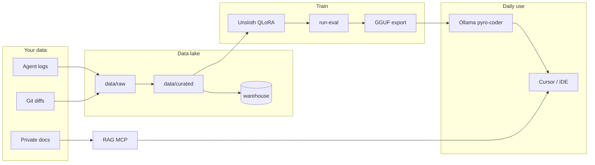

# Product overview

LLM Self Training is a **local, private coding copilot** that learns from your daily work. It is not a generic “upload JSONL and fine-tune” tutorial — it is an **operator system** with data hygiene, hardware-aware training, and **eval-gated promotion**.

## One-line pitch

**RAG for facts, QLoRA for style, eval gates before every promote** — on bare-metal Linux with a 12 GB GPU.

## What problem it solves

You already code with AI agents (Cursor, Codex, Claude Code, Aider, …). Those sessions contain your naming habits, patch style, debugging patterns, and tone — but base models do not retain them.

This project:

1. **Ingests** agent transcripts and git diffs from your machine
2. **Curates** tier-1 rows (accepted, safety-clean, optionally exec-verified)
3. **Trains** a QLoRA adapter on **Qwen2.5-Coder-7B** with Unsloth
4. **Evaluates** every candidate against internal suites
5. **Promotes** to Ollama only when all gates pass

Facts about public libraries stay in **Context7** (IDE time) and **local RAG** (your docs). Weights learn **how you work**, not encyclopedic API knowledge.

## Target user

| Fit | Not a fit |
|-----|-----------|
| Solo dev or small team on **Linux + NVIDIA** | Multi-GPU cluster training |
| **RTX 4070 Ti class (12 GB VRAM)** as reference | Cloud-only inference |
| Uses **Ollama** + optional **Cursor** BYOK | Docker-based SWE-bench harnesses |
| Wants **weekly improvement loop** with visibility | One-shot fine-tune-and-forget |
| Comfortable with Makefile / uv CLI | Black-box managed ML platform |

**Ideal workflow:** Code daily with agents → run Phase 1 weekly → train → eval → export GGUF → `ollama create pyro-coder:7b` when gates pass.

## Three-layer architecture

| Layer | Responsibility | Update cadence |
|-------|----------------|----------------|
| **RAG** | Private/project doc truth | Weekly crawl + re-index |
| **QLoRA (Unsloth)** | Style, structure, patch habits | Weekly, eval-gated |
| **Orchestration** | Ingest → curate → train → promote | systemd timer (planned) |
| **Control plane** | Data lake, runs, benchmarks, quarantine | Dashboard + API + warehouse |



## Eval-gated loop

**Train completing ≠ promote.** Promotion requires evidence from internal eval suites.

### Internal suites (hard gates)

| Suite | Purpose |
|-------|---------|
| `tasks_diff_apply.jsonl` | **Primary** — `git apply` + tests on frozen snapshots |
| `tasks_style.jsonl` | VERDICT pairwise judge + CPU style lint |
| `tasks_debug.jsonl` | Bug-fix pass rate vs base |
| `retrieval_gold.jsonl` | RAG hit-rate@5 (Phase 4+) |

Minimum **15–25 real tasks** per suite from your repos (placeholder templates pass bootstrap only).

### Promotion rule

```
ALL internal suites → "verdict": "pass"
+ external benchmarks must not regress past floor
→ merge adapter → GGUF → ollama create pyro-coder:7b
```

### Bootstrap vs real promote

| Mode | Command | Expected today |
|------|---------|----------------|
| Bootstrap | `run-eval --no-smoke-chat` | Pass on placeholder suites |
| Real promote | `run-eval --strict` | Fail until real tasks added |

### Continual learning

- **Replay buffer** (tier-2 + sampled tier-1) for anti-forgetting
- **Mandatory replay consolidation** post-train (planned)
- **Quarantine** on benchmark regression — demote `train_tier`, never delete raw logs

## Phases (roadmap)

| Phase | Milestone | Exit criteria |
|-------|-----------|---------------|
| **0** | Baseline + Ollama | Coder pulled; eval JSONL stubs |
| **1** | Data lake | ≥200 tier-1 rows; 50-row safety audit |
| **1.5** | Control plane | Warehouse + API `:8080` + dashboard `:5173` |
| **2** | QLoRA v0 | Adapter + bootstrap eval pass |
| **3** | Logger + RAG MCP | Allowlist index; MCP for IDE |
| **4** | RAG v1 + retrieval gold | hit-rate@5 ≥ 80% |
| **5** | Weekly loop | systemd timers; quarantine automation |

Historical detail: [archive/PLAN.md](../archive/PLAN.md), [archive/ROADMAP.md](../archive/ROADMAP.md).

## What makes this different from generic fine-tuning

1. **Three-layer split** — RAG / Context7 / QLoRA / code-graph each have a job
2. **Personal-first curation** — tier-1 gate on accepted + exec/verify + safety
3. **Exec-verified rows** — git-linked diffs, not raw agent dumps
4. **Eval-gated promotion** — not loss curves
5. **Bare-metal operator console** — Turso warehouse, dashboard, Makefile
6. **Hardware-realistic** — every default validated for 12 GB VRAM
7. **Weekly closed loop** — ingest → curate → train → eval → promote or quarantine

## Hardware assumptions

| Component | Reference spec |
|-----------|----------------|
| GPU | **NVIDIA RTX 4070 Ti — 12 GB VRAM** |
| RAM | 32 GB (activation offload path) |
| OS | Linux, bare metal (**no Docker** for train/eval) |
| Disk | 100 GB minimum on data volume; 250 GB comfortable |

### Model roles on 12 GB

| Model | Role |
|-------|------|
| `qwen2.5-coder:7b` | Ship inference + QLoRA base |
| `nomic-embed-text` / `qwen3-embedding:4b` | RAG embeddings |
| `deepseek-r1:7b` | Swap-only debug eval judge |

**GPU rule:** One heavy job at a time — train **or** chat **or** embed batch. `train-qlora` stops Ollama and configured systemd units by default.

## Non-goals

- Docker eval harnesses (official SWE-bench rejected; use frozen worktrees)
- Bulk-training npm/docs into weights
- Content-policy / refusal filtering on training data (secrets + PII only)
- 14B+ daily drivers on 12 GB
- Preference optimization before replay baseline works

## Ship model

Default export path: merge LoRA → Unsloth Dynamic 2.0 GGUF → `ollama create pyro-coder:7b`.

See [USER-GUIDE.md](USER-GUIDE.md) for operator commands and [ARCHITECTURE.md](ARCHITECTURE.md) for implementation detail.
